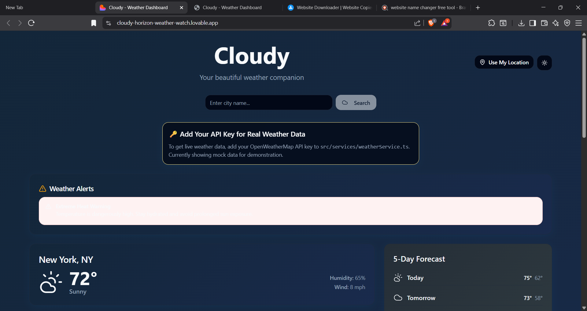
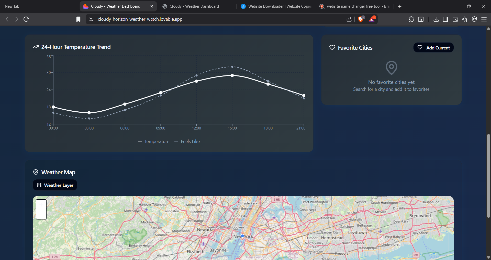
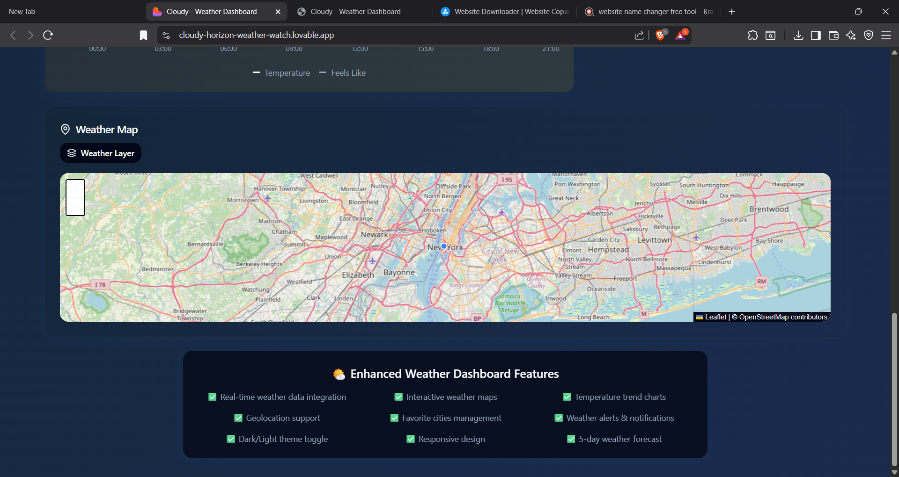

# 🌦️ Cloudy – Weather Dashboard

**Cloudy** is a sleek and responsive weather dashboard built to deliver a beautiful and informative weather experience. It features real-time weather data (via API), geolocation, interactive temperature charts, and a dynamic 5-day forecast — all packed into a clean, mobile-friendly interface.

---

## 🔗 Live Demo

👉 [Visit the Website](https://cloudy-horizon-weather-watch.lovable.app/)

---

## 🧠 Key Highlights

- 📍 **Geolocation-based search**
- 🔄 **Live weather alerts** with warnings (e.g., heat, storm)
- 📊 **24-hour temperature trend** using dynamic graphs
- 🌍 **Interactive weather map** with real-time data layers
- 🌙 **Dark/Light theme toggle** for accessibility
- 📅 **5-day weather forecast**
- 💡 **"Use My Location"** button with automatic city detection
- ✅ Fully **responsive design** – works great on desktop, tablet & mobile!

---

## 🛠️ Tech Stack

- **Frontend:** HTML5, CSS3, JavaScript
- **Visualization:** Chart.js / D3 (conceptual for graphing)
- **Mapping:** Leaflet.js with OpenStreetMap
- **API Used:** OpenWeatherMap API (demo mode used)
- **UI/UX:** Mobile-first design, toggleable themes

---

## 📸 Screensots

<h2>you can check your city's weather just by putting the name here</h2>

<h2>you can watch the chart of daily weather from here</h2>

<h2>they weather map of world</h2>

